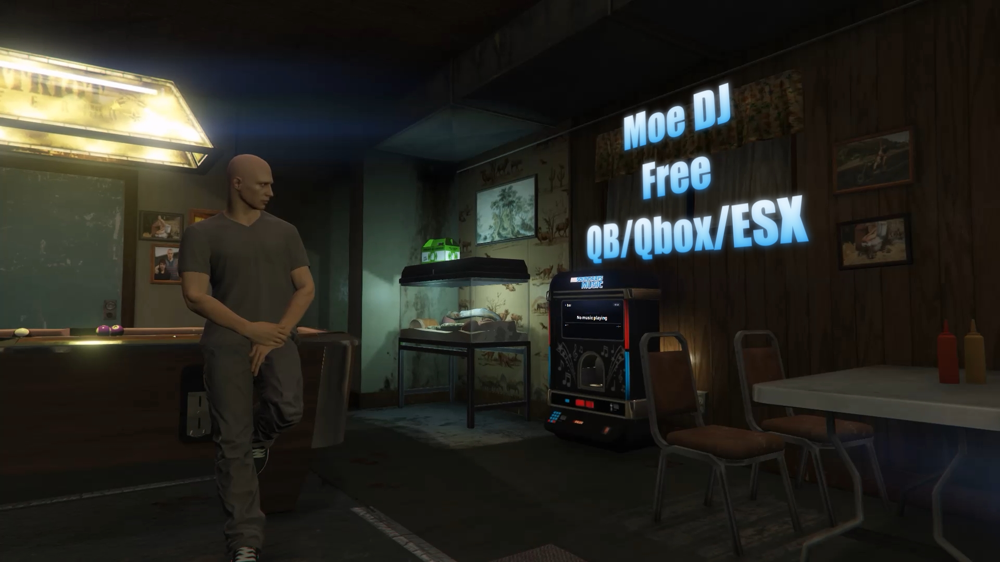

# Moe DJ

A **free, standalone** proximity DJ-booth network for FiveM. Place DJ booths around your map, queue YouTube and direct audio links, and let players hear synced music that fades naturally with distance — all configured **in-game**, with **zero script dependencies**.

> Works on **QBCore, Qbox, ESX, or a pure standalone server**. No inventory, target, or voice system required.

[](https://youtu.be/dVDSA9FNYHg)

*▶ Click the image to watch the showcase.*

---

## Features

- 🎚 **In-game booth manager** (`/djmanager`) — create, edit, reposition, and delete booths with a walk-and-confirm placement flow. No file edits, no restarts.
- 🔊 **Up to 10 speakers per booth**, all playing the same track in perfect sync.
- 🎧 **Proximity audio** — volume rises as you approach a speaker and fades as you leave (linear or quadratic falloff).
- ⏱ **Server-authoritative sync** — everyone hears the same point in the track, including players who join mid-song.
- 🔐 **Per-booth job + grade locks** *(framework servers)* — lock a booth to a job and optional grades, or leave it open to anyone. The option auto-hides on coreless servers.
- 🎯 **ox_target / qb-target support** — auto-detected; falls back to a keybind prompt when neither is present.
- ▶ **Queue management** — add, reorder, remove; play/pause/skip/stop; per-booth base volume; resolved track titles + duration.
- 📃 **YouTube playlists** — paste a `youtube.com/playlist?list=…` link and it expands into individual tracks (up to 100), each kept in server sync.
- ⏭ **Auto-skip dead tracks** — a link that fails to load anywhere is skipped automatically after a short grace window.
- 🗺 **Live map blips** — a booth's blip turns gold and shows `(LIVE)` while it's playing, so players can find the party.
- 🗂 **Persistence** — no database required (booths use oxmysql when available, otherwise JSON; queues are always JSON).
- 🧩 **Exports** — read live booth state to build your own signs, blips, and add-ons.

## Install

1. Drop the `moe-dj` folder into your `resources`.
2. Add to `server.cfg`, after core if applicable:
   ```cfg
   ensure moe-dj
   add_ace group.admin moedj.admin allow   # who can run /djmanager
   ```
3. Restart. Run `/djmanager` in-game to place your first booth.

## Usage

- **Owners:** `/djmanager` → *Create booth* → pick a jukebox model + place it, add speakers, (optionally) lock to a job/grades → save.
- **DJs:** walk to the booth's jukebox — use the **target** option (ox_target / qb-target) or press **E** — then paste a link and hit play on the screen.
- **Listeners:** just walk into range. No UI, nothing to press.

## Permissions

| Booth setup | Who can DJ |
|---|---|
| Job blank | Anyone |
| Job set, grades blank | Any grade of that job |
| Job set, grades `2,3` | Only those grades of that job |
| *(no framework core)* | Job option hidden — every booth open to anyone |

`/djmanager` itself is always gated behind the `moedj.admin` ACE.

## Configuration

All settings live in [`config.lua`](config.lua): core selection (`auto`/force/`none`), falloff range & curve, max speakers, sync/drift tuning, anti-grief cooldowns, jukebox interaction key/target, the DUI screen, allowed audio hosts, and branding links.

## Exports

```lua
exports['moe-dj']:GetBooths()        -- list of all booths + state
exports['moe-dj']:GetBoothState(id)  -- one booth's current state
```

## DUI screen

Moe DJ renders a live "now playing" display in front of an in-game prop (default: the clubhouse jukebox `bkr_prop_clubhouse_jukebox_01a`) using [DUI](https://docs.fivem.net/docs/scripting-manual/nui-development/dui/). The screen shows the **nearest booth's** track, status, and progress; it's display-only (audio still comes from the proximity speakers).

The jukebox prop is **placed as part of booth setup** (`/djmanager` → edit a booth → **Place prop**), and the resource spawns it for nearby players. Rather than editing the prop's textures, the DUI is drawn as a **flat quad anchored to the prop**, so it works no matter how the prop's own textures are packed. Configure under `Config.Dui` in [`config.lua`](config.lua).

**Multiple prop models:** `Config.Dui.models` is a list of jukebox models, each with its own screen `surface` (the quad's offset/size in that model's local space). When placing a booth's prop, the owner **picks which model** from the manager dropdown (hidden if only one is configured). Add your own models to the list to offer different jukeboxes.

**Setting it up:**
1. In `/djmanager`, create/edit a booth, pick a model, and click **Place prop** — walk to the spot and confirm.
2. To fit the screen on a **new model**, add it to `Config.Dui.models` with a rough `surface`, then run **`/djscreen`** next to one in-game: arrows / PageUp-Down move it, `[` `]` resize width (hold **Shift** for height), **Enter** prints the tuned `surface` to console to paste back into that model's entry, **Backspace** exits.

(If a screen doesn't appear, `/djdui` prints diagnostics.)

**Interactive jukebox:** the jukebox prop is the booth's DJ interaction point. With **ox_target / qb-target** installed you get a "Use jukebox" target option; otherwise walk up and press **E**. Either way the camera frames the screen and the on-screen **DJ panel** appears — move the mouse to drive the on-screen cursor, **left-click** to press buttons (play/pause/skip/stop, volume ±), the paste box adds links, and the Queue button pops out the queue manager. **Backspace** exits. Interaction key/distance/target are the top-level `Config.Interact*` settings; focus camera/cursor tunables live in `Config.Dui`.

Notes/limits:
- The prop is a **local object** spawned per client at the placement — no map editing needed.
- If the screen looks **mirrored or clips into the body**, nudge `surface.y` (it's drawn double-sided, so it won't vanish — just tweak the forward offset).
- One DUI is shared, so multiple visible jukeboxes show the booth nearest you.

## Optional integrations

- **ox_target** or **qb-target** — if either is running, booths use it automatically (config: `Config.UseTarget`). No setup needed; remove both and it falls back to the `E` keybind prompt.

## Notes / known limits (v1)

- YouTube playback uses the **official IFrame API** inside the NUI frame (no audio extraction). Some videos are un-embeddable (age/region/embedding-disabled); these are detected and **auto-skipped** after `Config.EmbedErrorGrace`.
- Overlapping booth ranges are allowed; place speakers sensibly.
- Job/grade changes propagate to a player's DJ access within `Config.AccessRefreshInterval` (default 15s) or immediately when a booth is edited.

## Support

Moe DJ is free and MIT licensed. If it helps your server, you can support development:

[](https://ko-fi.com/moesoftware)

---

Made by **Moe Software** • [Discord](https://discord.gg/jF67XzaNUG) • [More scripts](https://www.moesoftware.com/) • [Ko-fi](https://ko-fi.com/moesoftware)
MIT licensed.
